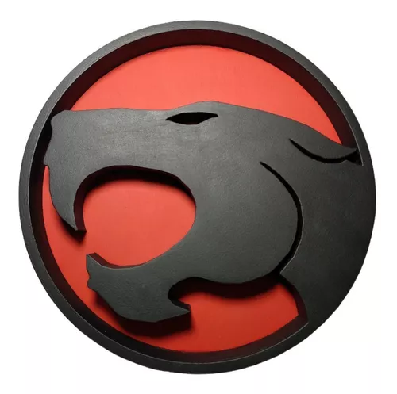

# Thunder-Market: The ThunderCats Marketplace (wip)

Welcome to Thunder-Market, the exclusive marketplace for the heroes of the ThunderCats world! This project aims to provide a unique buying and selling experience for the beings of Thundera and beyond!

## 🚀 Main Features

1. **Specialized Stores:** Explore unique shops, each representing a specialty from the ThunderCats universe (wip).

2. **Character Integration:** Embody your favorite heroes while browsing the marketplace (to do).

3. **Auction System:** Participate in auctions for exclusive and rare items (wip).

4. **Secure Payments:** Secure transactions for both buyers and sellers (todo).

5. **Assynchrony communication:** RabbitMQ.

6. **Database:** Efficient storage with Postgres.

7. **Secure Authentication:** JWT to ensure authorized access.

## 🛠️ Technologies Used

- **Java 17:** Robust and efficient development.
- **Spring Boot 3:** Rapid development and RESTful APIs.
- **RabbitMQ:** Efficient asynchronous communication.
- **Postgres:** Scalable storage.
- **JWT:** Secure authentication.
- **Docker:** Containerization.

🎯 Final Objective
Thunder-Market aspires to be the preferred destination for shopping in the ThunderCat universe, offering a unique platform to buy and sell the most extraordinary treasures. Join us on this exciting journey and be part of the commerce revolution for the beings of Thundera and other inhabitants of the third world!

📝 License
This project is licensed under the MIT License.

Note: This project is fictional and is part of a learning and development environment. Thunder-Market has no official affiliation with the ThunderCats brand.

